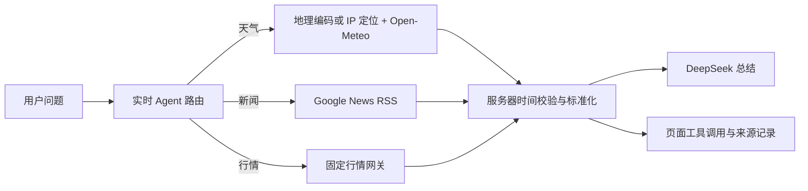

# 默认实时数据 Agent 设计

## 目标

将聊天中的时效问题交给受控工具自动处理：后端先获取真实数据并比较服务器时间，再将结构化结果交给 DeepSeek 总结。用户不需要手动开启“联网搜索”，模型也不能以“请去某个网站或 App 查询”代替可用工具调用。

## 范围

- 支持天气、新闻和已接入的金融行情三类时效问题。
- 天气问题识别用户明确给出的城市；没有城市时才使用请求 IP 所在地区。
- 保留现有数据来源、超时、服务器时间过滤和页面工具调用记录。
- 不新增任意网页访问能力，也不将用户输入拼接为任意 URL。

## 方案比较

1. 规则路由与白名单工具：后端根据意图和参数选择固定工具；推荐采用，来源、时效和安全边界可审计。
2. 由模型选择函数调用：灵活，但可能漏调、误调或在无结果时退化为建议用户自行查询。
3. 任意网页浏览：覆盖面较广，但来源稳定性和安全边界无法满足默认自动联网要求。

## 架构

## 路由与参数

- 实时 Agent 默认启用，不读取前端的联网开关作为调用前置条件；前端状态改为“自动联网”。
- 天气意图包含天气、气温、降雨、台风、风力或湿度等词。
- 新闻意图包含新闻、消息、报道、资讯、公告或研报等词；单独出现“今天”只用于日期上下文，不触发新闻搜索。
- 天气问题先提取明确城市，例如“上海今天天气”；城市命中地理编码结果后使用该城市坐标与时区。
- 未提取到城市时，使用 IP 定位结果作为天气地点。
- 新闻与行情沿用已有的实体/代码解析；新闻检索词只保留实体，不加入自然语言指令或日期文本。

## 工具结果与模型约束

- 每次工具调用均输出 `tool` 和 `tool_result` SSE 事件。
- 工具结果包含来源、服务器时间、观测或发布时间，以及相对于服务器时间的秒级时差。
- DeepSeek 的系统上下文明确要求：实时意图必须以工具结果作答；不得建议用户转去 App、搜索引擎或网站执行本 Agent 已支持的查询。
- 工具失败时，模型只能说明特定数据源不可用、已尝试的来源和失败代码；不得编造数据，也不得将查询工作交给用户。

## 数据源与安全边界

- 天气：固定使用 IPWho.is（IP 回退定位）、Open-Meteo（天气）和固定地理编码服务（显式城市）。
- 新闻：固定使用 Google News 中文 RSS。
- 行情：沿用腾讯财经、Yahoo Finance、Binance 等已配置固定源。
- 所有请求具有超时、响应结构校验和固定域名；拒绝未来时间戳数据。

## 页面行为

- 对话中展示每个工具的调用名称、查询参数、来源和时间差。
- 天气来源显示请求城市或 IP 回退城市、观测时间和服务器时间。
- 工具失败显示可读错误码和已尝试来源，避免只显示泛化的“没有数据”。

## 验收标准

1. 关闭旧联网开关或不传该字段时，输入“上海今天天气怎么样”仍会自动调用天气工具。
2. 天气工具使用上海坐标和 `Asia/Shanghai` 时区，而不是请求 IP 的城市。
3. DeepSeek 收到天气工具成功结果后，回答包含工具返回的天气数据，不建议用户前往第三方 App 或网站查询。
4. Open-Meteo 失败时，页面显示 `weather_unavailable` 及来源记录，模型不编造天气、不转嫁查询步骤。
5. 新闻、行情的现有默认自动工具调用与服务器时间筛选不回归。
