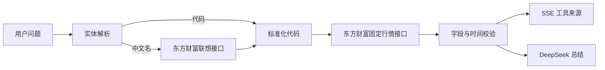

# 东方财富中文名称行情 Agent 设计

## 目标

让用户以 A 股中文名称、证券代码或指数名称提问时，服务端先通过固定东方财富联想接口解析规范代码，再拉取真实行情快照，将来源与时间交给 DeepSeek 总结。

## 范围

- 支持 A 股中文简称和 `000001.SZ`、`600519.SH` 等标准代码。
- 支持常见指数名称，例如“上证指数”。
- 东方财富为中国市场的主报价来源；现有腾讯报价仅在东方财富不可用时降级。
- 保留美股、港股和加密资产的现有显式代码路径。
- 不增加任意 URL、网页抓取或投资建议能力。

## 数据流

## 名称解析

1. 优先识别显式代码，保持既有代码行为。
2. 对未识别的中文候选词调用固定东方财富联想接口；只接受结果中的 A 股或指数记录，转换为规范代码。
3. 指数名称使用受控别名表补充，例如“上证指数”映射为 `000001.SH`。
4. 最多解析三个标的，去重；无匹配时不制造行情工具结果。
5. 对话中的完整自然语言不会直接作为行情 URL 参数，只将受限候选词传给固定联想 URL。

## 行情与约束

- 东方财富 A 股/指数报价使用固定 `push2.eastmoney.com` 行情 URL，解析价格和涨跌幅。
- 成功结果携带 `symbol`、显示名称、来源、快照时间/延迟信息；失败携带受限错误码。
- 只要用户的查询被解析为行情实体，DeepSeek 上下文都要求：不得编造价格，也不得建议用户转到财经网站、交易软件或搜索引擎完成已支持的查询。
- 页面沿用现有工具调用记录，显示输入名称、解析代码、数据源与时间。

## 验收标准

1. “贵州茅台最新行情”会先调用东方财富联想接口，解析出 `600519.SH`，再调用行情工具。
2. “上证指数现在多少”会解析为 `000001.SH` 并调用行情工具。
3. “600519.SH 最新行情”不需要联想请求，直接查询报价。
4. 成功与失败路径都显示 SSE 工具来源；失败时 DeepSeek 不建议用户自行访问财经网站或交易软件。
5. 现有港股、美股、加密货币显式代码查询不回归。

## 授权边界

东方财富公开接口仅用于本地开发和内测演示。生产环境需要按数据供应商许可确认展示、缓存与再分发权限；适配器协议保持稳定，便于替换为已授权供应商。
