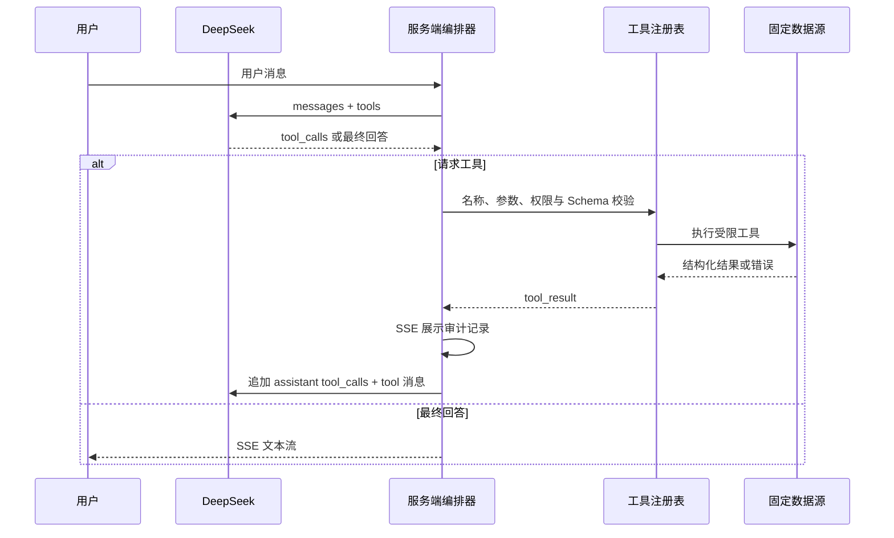

# 模型自主工具调用设计

## 目标

将当前由服务端关键词/正则决定天气、新闻和行情工具调用的流程，升级为模型根据用户消息和受控工具清单自主选择工具的多轮调用流程。服务端仍拥有工具执行权，不执行模型生成的任意代码。

## 范围

- 将天气、新闻、行情等既有能力注册为统一的受控工具。
- 通过兼容 OpenAI 的 `tools` / `tool_calls` 协议让模型选择工具及参数。
- 支持一次对话中连续调用多个工具，直到模型输出最终文本或达到调用上限。
- 延续现有 SSE 工具调用记录、固定数据源、超时、响应校验和失败提示。

不包含：模型生成并执行 JavaScript/Python、任意 URL 访问、绕过现有数据源和权限边界。

## 架构

## 工具边界

工具注册表是唯一的执行入口。每个工具定义：

- 名称、面向模型的用途描述与 JSON Schema 参数定义。
- 服务端执行器、允许的数据源、最大执行时长和调用权限。
- 面向模型与页面的结构化成功/失败结果。

首批工具为 `get_weather`、`search_news`、`get_quote` 和资产解析工具。天气工具接受城市等显式参数；无法确定地点时，模型可要求澄清，或在用户授权的 IP 回退语义内由执行器定位。行情工具先解析实体，再查询报价，避免让模型猜测股票代码。

## 调用循环

1. 服务端发送历史消息、系统安全约束和完整工具清单给模型。
2. 模型返回最终文本时，服务端原样流式转发并结束。
3. 模型返回 `tool_calls` 时，服务端逐一验证工具名、JSON 参数、字段范围和调用配额。
4. 服务端执行通过验证的调用，向前端发出 `tool` 与 `tool_result` SSE 事件，并将结果作为 `role: tool` 消息追加到模型上下文。
5. 服务端再次请求模型；单次用户轮次设定最大工具轮数与总调用数，超限时返回明确的受控错误上下文。

模型不能选择未注册工具；参数不合法、工具异常或上游数据异常均作为结构化工具错误回传模型。模型被明确禁止基于失败结果编造实时数据。

## 安全与可观测性

- 服务端严格白名单工具名，使用 Schema 校验参数并拒绝额外字段。
- 不将模型返回内容用作代码、Shell 命令或任意 URL；所有外部访问来自工具内固定或经验证的端点。
- 为每轮调用设置超时、最大轮数、总调用数和单工具配额。
- SSE 工具事件记录工具名、经过脱敏/规范化的参数、来源、时间和错误码；不输出内部密钥或原始 IP。
- 现有工具响应结构校验、未来时间排除与数据来源说明保持有效。

## 迁移与兼容性

- 删除聊天编排器中的天气、新闻、行情关键词路由；保留底层天气、新闻和行情适配器，改由工具执行器调用。
- 扩展 DeepSeek 的流式 SSE 解析器，使其可聚合分片的 `tool_calls`。
- 前端沿用既有 SSE 协议；必要时为新增工具类型补充显示名称和结果卡片。
- 在模型或供应商不支持工具调用时，明确返回配置错误，而不是静默退回旧的正则路由，确保实际行为与新设计一致。

## 验收标准

1. 同一语义的不同问法可由模型选择天气、新闻或行情工具，而聊天编排器不再包含对应的关键词路由。
2. 模型可先解析资产名称、再查询行情，并在拿到结果后完成回答。
3. 未注册工具、无效 JSON、越界参数、超时和超过调用配额均不会触发外部执行，并可审计地返回错误。
4. 工具结果通过 `role: tool` 追加给模型；模型最终回答仅依据返回结果，不编造实时数据。
5. 页面继续展示每次工具调用与结果，现有天气、新闻和行情测试覆盖迁移后的成功与失败路径。
