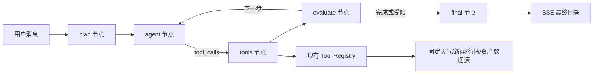

# TypeScript 与 LangGraph 规划编排设计

## 目标

将 `deepseek-agent-demo` 全量迁移至 TypeScript/TSX，并接入 Node.js 版 LangGraph。LangGraph 负责受控的目标规划、工具回路与结束判断；现有受控工具注册表继续负责参数校验、固定数据源访问、结果规范化、安全约束与取消传播。

## 范围

- 将应用源码、服务端、工具层、测试和构建配置从 JavaScript/JSX 迁移为 TypeScript/TSX。
- 新增 `@langchain/langgraph`，以 `StateGraph` 管理一次聊天请求的规划与工具执行状态。
- 为每个请求维护目标、最多三项计划步骤、当前步骤、模型消息、工具结果、工具回合数、调用总数和错误状态。
- 保持现有 SSE 事件协议、白名单工具、最多三轮/六次调用限制、工具输出防注入、断连取消及金融上下文校验。

不包含跨会话长期记忆、向量检索、用户画像、外部 checkpoint 存储或人工审批节点。

## 方案

采用 LangGraph 包裹现有编排能力，而非替换现有工具与数据源：

### Graph 状态

`AgentState` 为单请求内存状态，包含：

- `goal`：从最新用户消息获得的简短目标。
- `plan`：最多三项、只包含字符串的执行步骤；规划失败时为空数组，图仍可继续。
- `currentStep`：当前执行步骤索引。
- `messages`：仅包含服务端可信系统消息、已过滤用户/助手历史和服务端生成的工具转录。
- `toolEvents`：用于向 SSE 前端输出的调用与结果记录。
- `toolRounds`、`completedCalls`：复用三轮/六次上限。
- `finalAnswer`、`errorCode`、`terminated`：最终输出与受控终止状态。

状态仅存在于当前 HTTP 请求；不会写入长期记忆。浏览器现有 IndexedDB 会话历史仍负责下一次请求的上下文。

### 节点职责

- `plan`：以结构化、受限提示生成目标与最多三步计划。无效规划降级为空计划，绝不阻止回答。
- `agent`：向 DeepSeek 发送当前消息和工具定义；流式转发正文/推理 SSE，收集原生 `tool_calls`。
- `tools`：调用现有 `ToolRegistry.execute`，向页面发送 `tool`/`tool_result`，并将结构化结果追加为 `role: tool`。
- `evaluate`：根据是否存在工具调用、是否有可执行计划步骤、调用上限、错误和断连决定回到 `agent` 或进入 `final`。
- `final`：确保仅发出一次 `done`，并在模型未输出正文时生成受控失败提示。

LangGraph 只决定节点间跳转；工具名称、参数、网络访问和数据结果仍由服务端注册表控制。Graph 不执行模型生成代码，也不提供任意 URL 访问。

## TypeScript 迁移

- 新增严格 `tsconfig.json`，启用 NodeNext ESM、React JSX、`strict`、`noUncheckedIndexedAccess`。
- 将 `server/**/*.js` 迁移为 `.ts`，`src/**/*.jsx` 迁移为 `.tsx`，无 JSX 的客户端模块迁移为 `.ts`，测试迁移为 `.test.ts`。
- 使用 `tsx` 执行 Node 测试和开发服务器；Vite 直接处理 TS/TSX。
- 为 SSE 事件、聊天消息、工具调用、工具结果、Graph 状态、市场数据和 HTTP 请求上下文定义共享类型。避免用 `any` 逃避边界校验。
- 现有运行和构建脚本改为 TypeScript 对应命令，补充 `typecheck` 脚本。

## 流式与安全边界

- Graph 节点将原有 SSE 事件原样写给前端，前端协议不因 Graph 改变。
- 服务端策略、工具输出防注入约束与受限金融上下文始终在图状态消息的最前端；客户端不能提供 `system` 或 `tool` 角色。
- 请求或客户端断连时，Graph 状态标记终止；当前模型/工具调用接收同一 `AbortSignal`，不执行后续节点。
- 遇到无效工具调用、调用超限或模型在禁用工具后仍请求工具时，图附加结构化错误并受控终止。

## 验收标准

1. `pnpm typecheck`、测试和生产构建均在没有 TypeScript 错误的情况下通过。
2. 仓库运行路径不再依赖项目内 `.js`/`.jsx` 源文件或 Node 直接执行未转译 TypeScript。
3. 对同一请求，Graph 先产出受限目标/计划，再由模型选择工具；每个工具结果都回到 Graph 状态并影响下一跳。
4. 天气、新闻、资产与行情继续通过既有注册表执行；不重新引入关键词预路由或任意网络访问。
5. 三轮/六次限制、断连取消、工具输出防注入、客户端角色过滤、金融上下文和 SSE 事件行为不回归。
6. 当规划生成失败或模型不调用工具时，图仍能流式返回最终回答。
