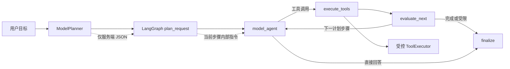

# 目标拆解驱动的自主决策设计

## 背景与目标

现有 LangGraph 已保存 `plan` 与 `currentStep`，但生产 Nest 装配未注入 Planner，且模型请求、工具执行和下一跳判断均未消费这两个状态。因此规划节点即使存在，也不能约束模型工具选择或推动任务进度。

本改造使每次聊天请求形成可验证的闭环：Planner 生成受限计划；当前步骤作为仅服务端可见的模型指令；工具执行或继续判断推进步骤；模型基于最新步骤、对话和工具结果决定下一次工具调用或最终回答。

不包含跨会话持久化记忆、checkpoint、人工审批、任意工具生成或动态网络访问。

## 架构与依赖

`Planner` 是应用层端口，与 `ModelClient`、`ToolExecutor` 同级定义，并提供 `PLANNER` 注入令牌。`ModelPlanner` 位于基础设施层，依赖 `ModelClient`，负责将目标转换为受限的结构化规划请求。

- `AppModule` 注册 `PLANNER`，以已配置的 `MODEL_CLIENT` 构造 `ModelPlanner`，并将其传入 `ChatApplicationService`。
- 未配置模型时，`UnavailableModelClient` 仍可被注入；Planner 降级为空计划，正式模型节点维持既有 `model_unavailable` 公共错误码。
- Planner 类型从 `agent/state.ts` 移至 application port；Graph 只依赖该抽象，不依赖具体模型或 Nest。

## 规划与状态流转

1. `plan_request` 将最新用户目标交给 Planner。Planner 发送固定服务端策略、目标和空工具列表，要求输出 `{ "steps": string[] }`。
2. `ModelPlanner` 拼接流式正文并严格解析 JSON。步骤仅接受字符串，随后经既有规范化逻辑限制为最多三步、每步最多 120 字符。
3. 规划网络错误、取消之外的模型错误、空输出、JSON 解析失败或非法形状都返回空计划；不会产生 SSE 错误，也不会阻断正式回答。
4. `model_agent` 在每一轮请求前读取 `plan[currentStep]`。若有当前步骤，将其加入服务端内部 system instruction，说明当前目标、完成条件，以及只能在满足当前步骤所需时选择注册工具。
5. `execute_tools` 完成一轮工具调用后推进 `currentStep`，但不超过计划长度。若模型不调用工具，则直接进入现有最终回答路径，当前步骤不再推进。
6. 当没有计划、最后一步完成、模型选择直接回答、发生无效调用、达到三轮或六次上限时，沿用现有路由规则结束或强制最终回答。

计划是单请求暂态：不写入浏览器 SSE、聊天历史、请求日志或任何持久化存储。只有服务端对模型的内部上下文可见。工具定义、参数校验、来源白名单和输出防注入规则不变。

## 错误、取消与安全

- `AbortSignal` 传入 Planner；规划阶段取消会立即终止图，且不会启动模型或工具节点。
- Planner 非取消错误统一降级为空计划；最终回答模型错误仍沿用 `model_unavailable`，避免暴露供应商信息或配置细节。
- Planner 请求不包含客户端历史、工具结果、API Key 或工具定义，降低提示注入和无关上下文泄露面。
- 当前计划指令由服务端构造，置于已存在的可信 system messages 区域；客户端不能伪造或覆盖它。
- 计划不是工具授权。模型即使被计划约束，仍只能调用 `ToolExecutor.definitions()` 暴露的受控工具，执行时继续经过闭合 schema 校验。

## 验证与验收

- `ModelPlanner` 单测覆盖请求边界、空工具、AbortSignal 传递、流式文本拼接、合法 JSON、非法 JSON 与模型错误降级。
- Nest 组合测试确认 `PLANNER` 已在生产模块注册，且 `ChatApplicationService` 接收它。
- Graph 测试确认当前计划步骤进入后续模型请求、工具轮结束后推进 `currentStep`、计划不出现在 SSE 事件中，并保持三轮/六次上限。
- 运行时测试确认 Planner 故障不阻断最终回答，未配置模型时仍只返回公共错误码。
- 完成时运行 `pnpm typecheck`、`pnpm test`、`pnpm build` 与 `git diff --check`。

## 不变量调整

旧设计中的“计划不进入模型提示词或 SSE”调整为：计划不得进入 SSE、客户端消息、持久化历史或日志；计划可以作为服务端拥有的内部指令进入模型请求。这是让计划实际影响工具路由和自主循环决策所必需的最小变更。
