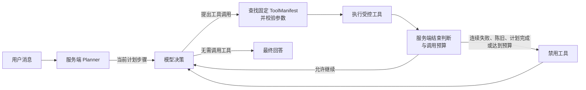

# 我把写死在代码里的 Agent 路由，改成了模型自主决策

> 我做这个 Agent 时，最初只想解决几个很具体的问题：查天气、搜新闻、看行情。结果真正让我反复返工的，并不是工具本身，而是“到底由谁决定调用哪个工具”。这篇文章复盘我如何从关键词路由走到模型自主选择，再用 LangGraph 和服务端规则把这份自主权关进可控边界。

## 一开始，我只是想让它查个天气

第一版需求很朴素：用户问“上海天气怎么样”，服务端先查天气，再把结果塞进模型上下文。我写了几组正则：出现“天气、气温、降雨”就查天气；出现“新闻、消息、报道”就搜新闻；识别到证券名称或代码，就走行情查询。

这套方案确实很快见效。输入标准问法，页面能显示工具状态，也能给出带时间的数据，看上去已经很像 Agent。

但我很快遇到了一个尴尬问题：“出门要不要带伞？”没有“天气”两个字；“帮我看看苹果最近发生了什么”可能是在问公司新闻，也可能是在问水果；“腾讯现在多少钱，顺便解释一下今天为什么波动”同时涉及资产识别、报价和新闻。

工具能工作，路由却听不懂人话。那一刻我意识到，我写的只是一组藏在聊天框后面的 `if/else`。

## 关键词路由为什么会随着能力增长变得难维护

关键词方案不只会漏掉同义表达。更麻烦的是，每加一种能力，规则之间都会发生组合。

天气要判断城市；新闻要清洗查询词；行情要先识别资产，再判断市场；一句话里同时出现“今天”“消息”和股票名称时，还要决定调用顺序。为了修一个误触发，我会补一个排除条件；排除条件又可能伤到另一个正常问法。

它还有一个隐蔽成本：语义判断散落在业务代码里。每增加一个工具，我不仅要实现工具，还要维护“哪些话算是在使用它”。用户语言是开放集合，规则却只能覆盖我提前想到的表达。

组合问题也没有固定模板。用户可能先查资产再查报价，也可能已经给了标准代码；可能只要新闻，也可能希望把新闻和行情放在一起解释。继续堆规则，本质上是在用字符串匹配手写意图模型。

于是我把语义判断交还给模型：服务端不再先猜关键词分支，而是把用户消息和工具清单一起交给模型，让它决定是否调用、调用哪个、参数是什么。

## 把工具选择交给模型，不等于让模型执行代码

这里最容易产生误解。

所谓“模型自主决策”，不是让模型生成 TypeScript 再运行，也不是让它随便拼网址。模型只能从已发布的工具中返回一个工具名和结构化参数。

例如，它可以提出调用 `get_weather`，参数是某个城市；也可以先调用资产搜索，再根据返回的标准代码请求报价。它不能新增一个 `run_shell`，不能修改工具定义，也接触不到执行器、网络凭证和内部配置。

以前是“代码理解用户并执行工具”，后来变成：

模型获得的是选择权，不是执行权。

## 真正可控的工具调用链路

我把每个工具收进部署期固定的 `ToolManifest`。除了名称和描述，它还包括闭合参数 schema、风险等级、超时时间和执行器。

模型提出调用后，服务端先按名称在固定清单里找到对应 manifest。当前发布的工具全部是 `read_only`，风险等级、闭合 schema、超时时间和执行器都在部署时绑定，而不是每次运行时再走一套独立的风险判断。

找到 manifest 后，服务端才解析 JSON 参数，拒绝未知字段、错误类型和超长内容，并按 manifest 的超时与执行器运行。若本次请求开启 `review=true`，调用会在执行前单独暂停，等待批准或拒绝。结果经过清洗后，再作为 `role: tool` 消息交还模型。

这意味着模型即使“选错了”，后果也是一次可描述的失败，而不是越过边界执行未知逻辑。未知工具返回 `unknown_tool`，参数不合法返回 `invalid_arguments`，上游超时也会变成稳定错误码。

因此，自主性只发生在模型选工具和组织参数这一段，执行仍由固定 manifest 约束。

## Planner 已经存在，却没有进入工具决策链路

让 LangGraph 接管完整工具循环前，项目已经有了 Planner 和一张独立规划图。它会根据目标生成最多三步计划，状态里也有 `plan` 和 `currentStep`。

但我重新检查数据流后发现，当时在线聊天的模型请求没有读取当前步骤，工具分支也不依赖它。计划写得再漂亮，都不会改变下一次决策。`plan/currentStep` 只是一份独立规划结果；即使接到页面上，也只是展示层状态。

这很有迷惑性：界面可以显示“正在分析”“正在查询”，真正决定工具的却是另一条链路。

我的判断标准变成了：Planner 的输出必须进入后续模型上下文、影响工具选择，并随工具结果推进。否则它更像进度条文案。Agent 工程不能只看“有没有模块”，还要看它是否真的改变状态迁移。

## LangGraph 如何接管自主循环

后来的改造，是把原本独立的规划图扩展成完整在线图，让 Planner、模型、工具和结束判断共享同一份请求状态。

Planner 先生成短计划；当前步骤作为服务端指令进入下一次模型请求。模型拿到对话、计划步骤和工具定义后，可以直接回答，也可以提出工具调用。工具节点完成校验和执行，把结果追加回消息，再进入模型节点。每完成一轮工具，`currentStep` 才向前推进。

也就是说，循环变成了：

`Planner → 模型 → 工具 → 模型 → 最终回答`

LangGraph 没有替我“变聪明”，它只是把状态和跳转关系显式化。

自主循环必须有刹车。当前服务端最多允许三轮工具交互、合计六次调用；连续失败、结果已经陈旧、计划完成或达到上限时，服务端会禁用工具，要求模型基于已有上下文直接作答。请求取消则不同：图会立即终止，不再产生后续回答。这些限制都写在服务端，模型不能自行解除。

我宁愿让复杂问题在边界处停下来，也不希望它因为“再试一次”进入长循环。

## 流式输出与桌面端带来的真实踩坑

Agent 跑通后，我以为最难的部分结束了。实际最耗时间的，反而是让用户感受到它稳定地工作。

第一个坑是 SSE。模型返回的是不规则文本分片，如果前端收到多少就立刻渲染多少，文字会忽快忽慢。我加了一层打字机队列，把分片逐字消费；收到 `done` 以后也不能马上结束，还要等待队列排空，否则最后几个字会消失。取消请求时则必须清空定时器，避免旧回答继续写进新状态。

第二个坑是并行与顺序。模型一轮可能提出多个工具调用。为了降低等待，我让合法调用同时启动；但如果谁先完成就先发事件，页面顺序和模型原始顺序会漂移，后续 `tool_call_id` 对应关系也更难排查。最后的做法是并行执行、统一等待，再严格按模型提出的顺序发送 `tool`、`tool_result`，并以同样顺序回传模型。

第三个坑是模型故障切换。备用模型只能在主模型产生首个上游事件之前接管；`tool_call_delta` 也算事件，一旦收到就锁定主模型。正文或工具调用已经开始后再切换，都会拼出不一致的上下文。取消请求也不能触发切换。

第四个坑来自 Electron 安装版：sidecar 的工作目录、实际 `userData` 目录，以及产品显示名对应的品牌目录可能不同。我曾把配置放在“看起来正确”的位置，客户端却始终报模型不可用。最后我固定了查找优先级，并要求改完配置后完全退出再启动。

这些都不是模型能力问题，却决定了它更像产品还是演示。

## 我最终保留的工程边界

经历这轮改造后，我没有追求让模型掌握更多权限，反而把边界收得更清楚。

工具只能在部署时注册，浏览器和模型都不能动态添加；参数必须匹配闭合 schema；外部访问只能通过固定执行器；单工具有超时，整轮有次数上限；工具输出被视为不可信数据，不能反过来成为系统指令；需要当前数据时必须经过工具，失败就如实说明。

Planner 失败时，系统可以退化为空计划继续回答，但不能伪装成已经完成了规划。LangGraph 状态只服务于当前请求，不被包装成长期记忆。桌面端也只是本地客户端和受保护的 sidecar，不意味着工具可以绕开服务端策略。

这些约束减少了“无限自主”的想象，却让行为更可解释、失败更可收敛。

## 写在最后

从关键词路由改到模型自主选择工具，我最大的收获不是少写了几条正则，而是重新划分了责任。

语义理解、工具选择和下一步判断，适合留给模型；发布哪些工具、参数是否合法、是否需要审批、调用多久必须停止、结果如何清洗，必须由服务端决定；LangGraph 则把规划、模型、工具与收敛策略连成一条真实的数据流。

所以我现在对“Agent 自主性”的理解很简单：

**模型拥有决策空间，服务端拥有执行控制权。**

两者缺一不可。只有控制，没有自主，随着能力增长，容易演变为不断膨胀的规则系统；只有自主，没有控制，则很难成为可以持续维护的工程。
