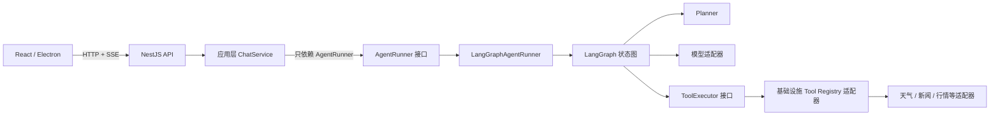
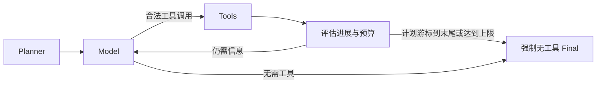

# 用 TypeScript、NestJS 和 LangGraph 搭建一个可控的 AI Agent

> 一个能调用工具的聊天机器人并不难写，难的是让它在参数错误、模型卡住、用户取消、多个工具并发时，仍然可预测、可测试、可停止。本文用一套简化架构说明：怎样让模型负责决策，同时把执行权牢牢留在服务端。

下面的 TypeScript 都是为讲清边界而写的伪代码，不是项目源码的逐字复制。

## 1. 先看完整架构

先不要急着写 LangGraph 节点。一个可控 Agent 的第一条原则，是让每层只知道它必须知道的东西。



NestJS Controller 负责协议：接收并规范化 HTTP 输入形态、创建任务、打开 SSE、感知断连。消息由领域函数筛选，文档、金融上下文和输出契约由应用层继续校验或收窄。应用层还负责整理消息、注入服务端策略、选择任务类型。LangGraph 只是 `AgentRunner` 的一个实现，应用层不直接导入图、节点或 LangGraph 类型。

这个边界很重要。以后把 LangGraph 换成自研状态机，或者为批处理换一套 Runner，ChatService 不需要改。依赖方向应当是“实现依赖接口”，而不是让业务代码被编排框架绑住。

## 2. 第一步：把工具定义成部署期能力

最危险的设计，是让模型或浏览器提交一段代码，服务端再执行它。正确做法是：工具在部署时就固定，模型只能从清单里选择名字并填写结构化参数。

```ts
interface ToolManifest<Input> {
  readonly name: string;
  readonly description: string;
  readonly schema: {
    type: "object";
    properties: Record<string, FieldRule>;
    required?: readonly string[];
    additionalProperties: false;
  };
  readonly risk: "read_only";
  readonly timeoutMs: number;
  readonly execute: (
    input: Input,
    signal: AbortSignal
  ) => Promise<unknown>;
}
```

一个 Manifest 至少回答六个问题：能力叫什么、何时使用、参数允许哪些字段、风险是什么、多久必须结束、最终调用哪个服务端执行器。

“闭合 schema”指 `additionalProperties: false`。服务端还要检查必填字段、字符串类型和最大长度。模型给出未知工具名、多余参数、残缺 JSON，都应返回稳定错误，而不是猜测性修正。校验通过后，也只能进入预先注册的执行器；工具注册表不接受来自 HTTP 请求或模型输出的动态注册。

图通过 `ToolExecutor` 端口传入父请求的 `AbortSignal`，注册表再为每个 Manifest 派生独立子信号：父请求取消时立即中止；单工具超过时限时只中止该执行器，并归一化成 `tool_execution_timeout`。这样上游数据源再慢，也不能无限占住 Agent。

## 3. 第二步：设计 Agent 状态

普通聊天只需要消息数组，Agent 却必须记住“已经做了什么”和“还能做多少”。状态不是为了塞入所有上下文，而是为了让路由决策有确定依据。

```ts
interface AgentState {
  readonly messages: readonly AgentMessage[];
  readonly plan: readonly string[];
  readonly currentStep: number;
  readonly pendingCalls: readonly ToolCall[];
  readonly toolRounds: number;
  readonly toolCalls: number;
  readonly consecutiveFailedToolRounds: number;
  readonly forceFinalAnswer: boolean;
}
```

`messages` 保存模型对话和工具回传；`plan` 是经过裁剪的短计划；`currentStep` 是计划游标；`toolRounds` 与 `toolCalls` 分别限制循环轮数和总调用数。当前实现每完成一轮工具就机械推进一次 `currentStep`，即使本轮全部失败也会推进；它不表示 Planner 已经语义判断该步骤完成，失败轮数会由另一项状态负责收敛。结果新鲜度等摘要，也会帮助服务端判断继续调用是否还有意义。

这里有两个容易忽略的点。第一，计划必须真正进入下一轮模型指令和状态迁移，否则它只是 UI 上的装饰。第二，不要把原始工具内容再拼成“路由提示”；工具结果是不可信外部数据，反馈给决策层的应是服务端派生的成功数、失败数、结果类型和新鲜度。

## 4. 第三步：建立 Planner、模型与工具循环

完整循环不是“模型调用一次工具就结束”，而是 Planner 先拆目标，模型决定是否调用工具，工具结果回到模型，直到生成最终答案。



在 TypeScript 中，可以把端口保持得很薄：

```ts
interface AgentRunner {
  run(input: AgentRunRequest): Promise<readonly AgentEvent[]>;
}

class ChatApplicationService {
  constructor(private readonly runner: AgentRunner) {}
  run(request: ChatRequest) {
    return this.runner.run(toAgentRequest(request));
  }
}
```

图内部则按 `Planner → Model → Tools → Model → Final` 迁移。Planner 失败可以降级为空计划，不必让聊天整体失败；模型没有工具调用时直接收尾；有调用时先校验、执行、回传，再进入下一轮。

停止条件必须由服务端掌握。例如：计划游标到达末尾、最多三轮工具、最多六次调用、连续两轮全部失败，或者关键数据已经陈旧。触发后，下一次模型请求不再携带工具，并明确要求基于现有上下文给出最终答案。模型不能自行解除这些上限。

## 5. 第四步：让并行执行保持确定顺序

模型可能在同一轮要求查询两地天气，或同时查询行情和新闻。只要工具合法且相互独立，就应该并发启动；但“并发完成顺序”不能变成“外部观察顺序”。

```ts
const jobs = validCalls.map(async (call) => {
  try {
    const result = await toolExecutor.execute(call, { signal: requestSignal });
    return { call, result };
  } catch (error) {
    if (requestSignal.aborted || isAbortError(error)) throw error;
    return { call, result: failure(call.name, "tool_execution_failed") };
  }
});
const completed = await Promise.all(jobs);

if (
  requestSignal.aborted ||
  completed.some(({ result }) => isCancelled(result))
) throw new DOMException("Request aborted", "AbortError");

for (const { call, result } of completed) {
  emit({ type: "tool", id: call.id, name: call.name });
  emit({ type: "tool_result", id: call.id, name: call.name, ...result });
  modelMessages.push(toToolMessage(call, result));
}
```

图把父请求信号交给执行端口，各 Manifest 的独立子信号和单工具超时由注册表内部创建。每个 job 只把非取消异常归一化为 `tool_execution_failed`；取消异常直接抛出。`Promise.all` 返回后、发布任何事件前，外层还会再次检查父信号和取消结果，一旦取消就立即以 `AbortError` 终止，不发送本轮 `tool` 或 `tool_result`。`map` 先创建所有 Promise，保证同轮并行；`Promise.all` 返回值仍按输入数组排列。随后按模型原始调用顺序发送 SSE，并按同一顺序构造回传模型的 `tool` 消息。`tool` 事件只公开 ID 和名称，不把参数顺手展开到事件中。

为什么不按谁先完成谁先发？因为前端时间线、调用 ID 与下一轮模型上下文会出现竞态：同一个输入有时是 A-B，有时是 B-A，测试和复现都变得困难。并行解决延迟，稳定排序解决确定性，两者并不冲突。

## 6. 第五步：用 SSE 输出完整运行状态

Agent 运行时间比普通接口长，用户不能只看着一个加载动画。SSE 应该输出语义事件，而不只是文本 token：

- `task`：先返回任务 ID 和运行状态；
- `plan`：展示步骤及待执行、进行中、已完成状态；
- `tool`：声明一次受控工具调用；
- `tool_result`：返回成功结果或稳定错误码；
- `reasoning`：传递可展示的模型推理提示；
- `approval`：告知前端当前调用正在等待人工决定；
- `agent`：报告受限子 Agent 的角色、状态和预算；
- `delta`：增量回答；
- `error`：可公开的失败信息；
- `done`：封闭 SSE 的流终止标记；即使前面出现 `error`，也会用它结束事件流。

```ts
writer.open();
writer.write({ type: "task", id: task.id, status: "running" });

await chatService.run({
  signal: controller.signal,
  onEvent: (event) => writer.write(event),
});

writer.finish(); // 保证 done 至多写一次，并关闭响应
```

事件可以统一写成 `data: {"type":"delta",...}\n\n`，前端按 `type` 分发。等待模型或审批期间，服务端每隔一段时间写 `: keep-alive\n\n` 注释帧，避免代理把安静连接误判为断开；注释帧不是业务事件，不应进入消息记录。

还要处理三个边角：先刷新 SSE 响应头；客户端断开后停止写入并传播取消；`done` 只能发送一次，之后的迟到错误必须丢弃。任务最终状态可留在任务运行时中供查询，不要把“连接关闭”误当成“任务成功”。

## 7. 第六步：处理模型超时、重试、熔断与降级

流式模型不能只设置一个笼统超时。至少需要三道时间边界：

1. **首事件超时**：请求发出后，多久还没有任何事件就判定不可用；
2. **空闲超时**：已经开始输出，但相邻事件之间停顿过久；
3. **总超时**：把重试和流式输出都算在内的绝对截止时间。

可恢复错误允许单次重试，但前提是模型客户端尚未产生任何上游事件，其中也包括内部的 `tool_call_delta`。这与备用模型共享同一条“零输出”原则。已经产出事件再重试，可能重复内容、重复工具调用或拼出矛盾结果。取消也不是故障，绝不能触发重试。

熔断器记录连续可恢复失败。达到阈值后进入 `open`，冷却期直接快速失败；冷却结束只放行一个 `half_open` 探测，请求成功才回到 `closed`。并发情况下还要给熔断状态加“代次”概念，避免较早启动、较晚成功的旧请求错误关闭新熔断。

备用模型遵循更严格的边界：只有主模型在首个上游事件前失败，才允许接管。这里的“上游事件”包括模型适配器已经产出的 `tool_call_delta`，即使它尚未转换成前端可见的工具事件。只要主模型产出过任何事件，后续失败就发送错误并结束，不能偷偷拼接备用模型；用户取消同样不切换。降级的目标是保持响应一致性，不是掩盖所有错误。

## 8. 第七步：加入取消、审批和后台任务

取消应该是一条贯穿全链路的信号，而不是前端隐藏消息。浏览器断开或用户点击停止后，Controller 中止父 `AbortController`；Planner、模型迭代器、工具注册表和外部适配器都监听它。已取消的结果不再写 SSE，任务状态标记为 `cancelled`。

审批适合做成图中的暂停点。开启人工复核模式后，待执行调用仍保留在 LangGraph 的 `pendingCalls` 状态中；`execute_tools` 节点等待审批协调器提供的进程内 Promise，协调器只管理审批 ID、等待句柄和过期时间。这不是可跨重启恢复的 LangGraph checkpoint。同步模式会直接从 SSE 收到 `approval` 事件；批准后继续执行，拒绝或过期则生成对应的 `tool_result`，再让模型在不调用新工具的情况下解释结果。

长任务可以使用后台模式。`background=true` 时接口只返回 `202 + taskId`，不再保持 SSE；调用方需要轮询 `GET /api/tasks/:id/events?after=` 回放增量事件，从中取得 `approval` ID，再调用 `POST /api/approvals/:id/:decision`。进程内服务会记录事件、结果和尝试次数；幂等键避免重复创建，失败或取消后可以重新尝试。任务默认只保留有限 TTL，例如十分钟。

当前通知能力也很克制：`TaskNotificationService` 只保存进程内通知记录，并提供可注册的 `in_app`、`webhook` 投递扩展点；组合根没有注册真实的用户可见通知或 Webhook 投递器。生产环境需要补上实际渠道。

必须诚实说明：这仍是进程内后台任务，不是持久化队列。服务重启、进程崩溃或 TTL 到期后，任务和审批都可能丢失。生产环境还需要数据库、消息队列、租约和跨实例协调，不能把内存 `Map` 当成最终方案。

## 9. 如何测试这套 Agent

Agent 测试不应依赖真实模型“今天是否听话”，而要按边界分层。

- **工具契约测试**：固定清单、闭合 schema、未知工具、多余字段、超时、父子取消信号、输出清洗。
- **状态图测试**：Planner 失败降级，Model/Tools 路由，计划推进，轮次与调用上限，连续失败、陈旧结果和强制收尾。
- **并发顺序测试**：让第二个工具先结束，仍断言 SSE 与回传模型消息保持第一、第二的原顺序。
- **SSE 测试**：响应头、事件格式、keep-alive、断连停止写入、`done` 幂等。
- **模型韧性测试**：首事件/空闲/总超时，首事件前单次重试，输出后不重试，熔断开闭与备用模型边界。
- **运行时测试**：取消传播、审批批准/拒绝/过期、后台任务 TTL、幂等与重试。
- **组合测试**：NestJS 依赖注入、健康检查，以及 Electron sidecar 启动、退出和环境隔离。

最后先跑 TypeScript 类型检查、全量测试，以及前端和服务端构建：

```bash
pnpm typecheck
pnpm test
pnpm build
pnpm build:server
```

其中 `pnpm build` 只执行 Vite 前端构建。需要验证 Electron 安装包的完整构建链路时，应单独运行 `pnpm desktop:build`。

## 10. 可以复用的最小架构

如果把金融、天气等业务名全部拿掉，这套 Agent 最小只需要六块：

1. 一个只暴露 `run` 与事件回调的 `AgentRunner` 端口；
2. 一组部署期固定、闭合 schema、带风险和超时的 ToolManifest；
3. 一个包含消息、计划、步骤与预算的状态；
4. 一条 `Planner → Model → Tools → Model → Final` 的有界循环；
5. 一套保持顺序的 SSE 事件协议；
6. 一层取消、超时、重试、熔断、降级和任务生命周期保障。

LangGraph 解决的是“怎样编排状态迁移”，NestJS 解决的是“怎样组合应用与基础设施”，TypeScript 则让端口、事件和状态在编译期对齐。真正让 Agent 可控的，不是其中任何一个框架，而是清晰的权力分配：模型拥有选择空间，服务端拥有能力清单、参数校验、执行权限、运行预算与最终停止权。
