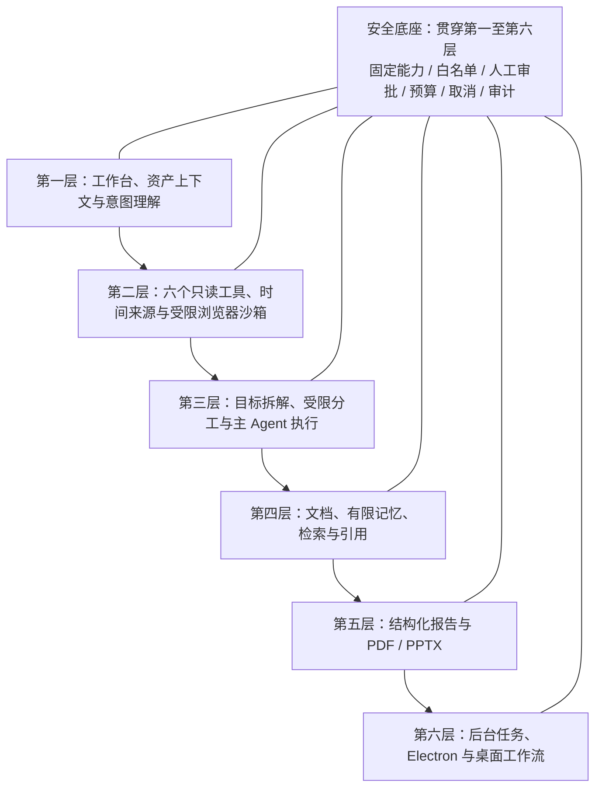

# 一个金融 AI Agent 应该具备哪些能力？这是我的完整答案

> 本文讨论的是金融研究型 AI Agent 的产品与工程能力，不构成投资建议。文中的 Demo 不承诺数据实时性、投资收益或生产可用性，也不会执行任何交易。

## 1. 聊天框并不等于金融 Agent

大模型接上聊天界面，能回答“这只股票怎么看”，并不代表它已成为金融 Agent。真正的分界线在于它是否知道用户研究什么、依据什么数据、如何暴露时间与来源，以及能否交付可检查的成果。

我更愿意把金融 Agent 看成一套受约束的研究工作流：聊天框只是入口，后面还要有资产上下文、数据工具、任务编排、引用治理、成果导出和安全控制。任何一层缺失，都可能让“聪明的回答”变成无法复核的文本。

## 2. 第一层：理解用户正在研究什么

金融问题高度依赖上下文。“苹果最近怎么样”可能在问公司新闻、股价走势，也可能只是产品体验。只靠一句自然语言，模型很容易选错对象。

产品上，金融工作台应当显式承载研究页签、资产选择和名称消歧。当前 Demo 已实现这些入口，并把校验后的资产上下文交给 Agent；目前尚未提供账户级偏好与跨设备上下文同步。

上下文不是替用户下结论，而是缩小问题空间。交易员 Copilot 只是研究入口，不等于下单入口。用户应当看到“当前研究对象是谁”。

## 3. 第二层：获得带时间和来源的数据

金融回答最危险的错觉，是把语言流畅误认为数据新鲜。当前 Demo 已实现六个部署期固定的只读工具：天气、新闻、资产搜索、报价、技术指标、经济日历。

这里的重点是“固定、只读、可校验”。模型可以提出调用，但工具名称、参数 schema、超时、数据源和执行器由服务端预先定义。模型不能注册新工具，不能临时更换上游地址，也不能把某段文本变成任意执行代码。

产品上，市场数据应当附带来源、观测时间、抓取时间、数据年龄和延迟状态。当前 Demo 已实现这些元数据，并显式呈现异常、陈旧和缺失；目前尚未具备生产级数据授权、SLA 和完整审计，也不把结果称为实时行情。

当前 Demo 已接入独立、受保护的浏览器 HTTP 能力，它不属于六个 ToolManifest，模型与当前聊天 UI 都不能直接调用。沙箱只允许导航、点击、文本提取和截图；白名单外域名、内网、回环和下载会被阻断，点击需人工审批。生产仍需安装 Playwright 运行时并完善审计回放。

## 4. 第三层：拆解目标并进行受限分工

产品上，自主计划应当受轮次、调用数、时限和终止条件约束，并让取消传播到下游。当前 Demo 已实现短计划与有界工具循环；目前尚未支持用户编辑计划或跨请求暂停恢复。

多 Agent 也不是多开几个模型互相聊天。在金融研究模式中，研究员只提出数据需求，风险复核员只给检查清单；它们不执行工具、不直接输出市场事实。所有外部数据仍由主 Agent 按同一份工具清单统一执行，最后由主 Agent 合并证据，避免权限扩散。

## 5. 第四层：处理文档、记忆与引用

真实研究经常从一份公告、研报截图或扫描 PDF 开始。Demo 支持 PDF 文本层提取，也能对扫描 PDF 和常见图片进行 OCR；但原始二进制只在请求内存中处理，进入对话的是经过大小、类型和内容约束的文本。对长文档，浏览器先分片，再按当前问题做请求级检索，只召回少量相关片段，不建立跨请求的永久文档索引。

记忆同样要克制。浏览器 IndexedDB 保存本地会话、消息、离线待重试队列和有长度上限的工作摘要。这种有限记忆能减少背景重复，却不是服务端用户画像或跨设备知识库，也不能覆盖系统安全策略。

产品上，引用应当可追溯。当前 Demo 已实现引用账本，记录来源 ID、内容哈希、请求哈希、观测时间和 provenance，执行链另行汇总数据新鲜度。受控 revalidate 接口与 refresher 扩展点已提供，但默认未注入实际刷新器，调用只会返回 `citation_expired`；目前尚未补齐刷新器、快照持久化、长期复现和完整 UI 展示。

## 6. 第五层：把回答变成可交付成果

产品上，研究结果应当以可校验契约收敛。当前 Demo 已实现结构化研究报告，包含标题、结论、证据和风险，并可附带 ISO 数据时间；非法格式会回退为 Markdown。目前尚未把报告持久化为跨设备资产。

产品上，导出应当复用同一报告对象。当前 Demo 已实现 PDF、可编辑 PPTX 和短期下载链接；聊天、引用和导出共享同一份经过契约校验的报告对象和来源标识，以减少复制转换造成的字段不一致。目前尚未提供长期文件库和权限化分发。

## 7. 第六层：支持长任务和桌面工作流

产品上，长任务应当可查询、取消、重试和通知。当前已实现进程内后台任务、事件回放、进程内通知记录，以及 `in_app` / `webhook` 投递扩展接口；组合根未注册真实投递器，也没有通知查询 API 或前端展示，真实站内通知与 Webhook 尚未接入。任务也不能在重启后恢复。

Electron 客户端通过 sidecar、随机回环端口和一次性会话令牌，为长时间研究提供桌面运行载体；渲染进程保持隔离且无 Node.js 权限。当前 UI 仍以同步 SSE 为主，尚未提供后台任务提交、事件轮询与恢复界面。

## 8. 金融场景必须明确的安全边界

我的底线是：这个 Agent 只做研究，不执行交易，不触碰资金。它不能提交订单、操作账户或绕过人工确认，也不应根据一段提示自行扩展权限。

模型不能注册工具，不能生成并运行任意执行代码，不能访问任意 URL。工具输出本身也按不可信输入处理，必须经过字段清洗、来源限制、超时和调用预算。涉及点击等有副作用的动作，要暂停任务并等待审批；拒绝、超时或连接断开都应默认停止，而不是“替用户继续”。

此外，结构化报告不等于事实保证，技术指标也不等于买卖信号。系统需要持续展示数据时间、来源和风险，把最终判断留给人。

## 9. 目前仍然没有解决的问题

这套 Demo 已经覆盖了研究型 Agent 的主要骨架，但离生产系统还有明确距离：

- 没有服务端持久化记忆，也没有跨设备会话；
- 没有可在重启后恢复的持久化任务队列；
- 没有生产级市场数据授权、租户权限和配额治理；
- 没有覆盖工具、文件、审批、导出与浏览器操作的完整审计；
- 文档检索仍是请求级的，尚未解决长期索引、数据保留和删除策略；
- 实际引用刷新器目前尚未接入，快照持久化、长期复现和完整 UI 展示也未解决。

这些缺口不能靠更大的模型补齐。它们涉及数据库、队列、数据许可、身份体系和合规流程，是产品能否上线的基础设施。

## 10. 从 Demo 到产品，我得到的判断

做完这套能力梳理后，我的判断反而更朴素：核心竞争力不是让模型说得更多，而是让系统知道什么时候该查、查什么、谁来查、数据有多新，以及如何把证据交给人复核。

一个像样的产品至少要形成这样的闭环：金融工作台提供准确上下文，受控工具获取带时间和来源的数据，受限角色提出需求与风险，主 Agent 统一执行，引用账本约束证据，结构化报告负责交付，后台任务和桌面端承载更长流程，安全边界则贯穿每一层。

从 Demo 走向产品，接下来最值得投入的不是增加工具数量，而是补齐持久化、授权、审计和可恢复性。Agent 可以更自主，但它的权限、证据和失败方式必须更清楚。对金融场景而言，这是基本的产品责任。
